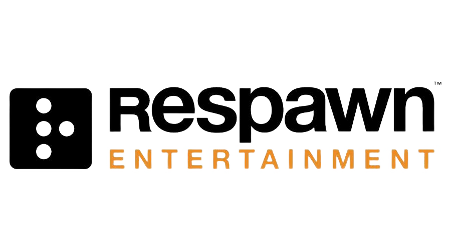

# Respawn Entertainment CRM System



## Overview

Welcome to the Respawn Entertainment CRM (Customer Relationship Management) system. This CRM is specifically designed to address the unique challenges faced by gaming cafes and shops. It leverages the power of Laravel, Tailwind CSS, and SQLite to provide a comprehensive solution that enhances customer engagement, streamlines operations, and ensures compliance.

## Features

1. **User Authentication:** Users can register, log in, and manage their accounts.

2. **Product and Game Management:** Admins can add, edit, and delete products and games.

3. **Online Orders:** Users can browse products/games and place orders securely.

4. **Gaming Cafe Reservation:** Users can reserve slots at the gaming cafe.

5. **Two-Factor Authentication (2FA):** Enhanced security with 2FA options.

6. **Order History:** Users can view their past orders.

7. **Reservation History:** Users can check their upcoming and past reservations.

8. **Admin Dashboard:** Admins have access to a dashboard with management capabilities.

9. **Email Notifications:** Users receive confirmation emails for orders and reservations.

10. **Payment Gateway Integration:** Seamless online payments through integrated gateways.


## Technologies Used

- Laravel: A powerful PHP framework for building web applications.
- Tailwind CSS: A utility-first CSS framework for creating responsive and customizable UI components.
- SQLite: A lightweight and easy-to-use database engine.

## Installation

Follow these steps to set up the Respawn Entertainment CRM system on your local machine:

1. Clone this repository to your local machine:

    ```shell
    git clone https://github.com/LaXnZ/respawn-entertainment.git
    ```

2. Change to the project directory:

    ```shell
    cd respawn-entertainment
    ```

3. Install Composer dependencies:

    ```shell
    composer install
    ```

4. Install NPM dependencies:

    ```shell
    npm install
    ```

5. Create a copy of the `.env.example` file and name it `.env`:

    ```shell
    cp .env.example .env
    ```

6. Generate an application key:

    ```shell
    php artisan key:generate
    ```

7. Configure your database connection in the `.env` file:

    ```shell
    DB_CONNECTION=sqlite
    DB_DATABASE=database.sqlite
    ```

8. Add your Mailtrap details to the `.env` file:

    ```shell
    MAIL_MAILER=smtp
    MAIL_HOST=smtp.mailtrap.io
    MAIL_PORT=2525
    MAIL_USERNAME=your-mailtrap-username
    MAIL_PASSWORD=your-mailtrap-password
    MAIL_ENCRYPTION=null
    ```

9. Add your OpenAI details to the `.env` file:

    ```shell
    OPENAI_API_KEY=
    OPENAI_ORGANIZATION=
    ```

10. Add your Stripe details to the `.env` file:

    ```shell
    STRIPE_SK=
    STRIPE_PK=
    ```

11. Migrate the database:

    ```shell
    php artisan migrate
    ```

12. Start the development server:

    ```shell
    php artisan serve
    ```

13. Visit `http://localhost:8000` in your web browser to access the CRM system.

---

**Note:** Ensure you replace `your-mailtrap-username` and `your-mailtrap-password` with your actual Mailtrap SMTP credentials.

With these steps, you'll have the Respawn Entertainment CRM system up and running on your local environment.

Enjoy managing your gaming cafe or shop with our CRM system!
